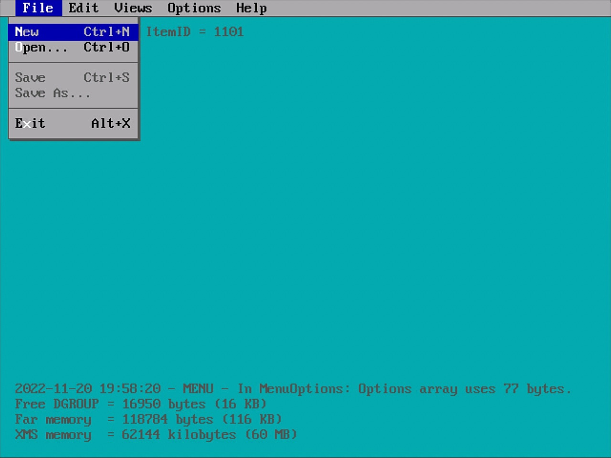

## Description

#### Work In Progress!

- An example of a module-based program written in QuickBASIC (QBX).
- Created for the challenge and fun of it, but it could be useful for something.
- Don't expect regular updates to this project, consider it archived.

## Development

### Compiler Version

- Created in and for Microsoft (R) QuickBASIC Extended v7.1 (PDS).
- Developed on DOSBox-X 2025.05.03 (SDL2). Reported DOS version 5.00.

## Highlights

### General Features

- Commented code where relevant, to follow what each module does.
- Default mouse cursor shape is set from internal DATA statements.
- Excluding comments, the main application loop is only five lines long!
- Exclusively uses Future.Library for memory, mouse, and screen graphics.
- First sixteen colors are defined as constants with appropriate names.
- Most arrays (except the shared 'Menu' array) are erased after each use.
- Mouse cursors inspired by the pioneering icon artwork of Susan Kare.
- No external programs used, except for a few shelled DOS commands.
- Rudimentary framework as a foundation for a menubar-based program.
- Screen states are saved to and retrieved from available XMS memory.
- Structured around 'Manager' sub-routines that handle specific tasks.
- User-defined types as data structures for all arrays and global variables.
- Using a 'structured programming' paradigm, no spaghetti code here!
- Web-links below were working when the project was last updated.

### Known Issues

- Example screenshot above is twice the screen mode of 640 x 480.
- Graphical glitch with the mouse pointer over displayed menus.
- Grey text on the screenshot above is for debugging use only.
- NOT compatible with QuickBASIC 4.5 or earlier versions!
- NOT tested on QB64 (may need tweaking and other things).
- Project assumes that the repo directories are at root of C: drive.
- Screen size currently limited to 640 x 480. See: SCREEN.BAS 
- TODO: code comments mark where things need to be done.

### Things To Do

- [ ] From ActionManager, display a dialog of the triggered action.
- [ ] Get Shortcut keys to work on enabled Menu items only!
- [ ] MousePreview SUB to display a dialog box for mouse cursors.
- [ ] Prevent a crash in MenuOptions if all menu items are disabled.
- [ ] Redraw the Menu 'Banner' some point after a mouse click?

## Influences

### Code examples that helped in some modules. 

- [MENU.BAS](http://brisray.com/qbasic/qtext.htm) – String manipulations adapted from an example by Ray Thomas.

## Libraries

### The only library used in this project.

- [Future.Library](http://www.phatcode.net/downloads.php?id=199) – Copyright © 1999-2000, Future Software.
- Created by Michael Rye Sorensen & Jorden Chamid.

## Repository

### What is contained in the repo directories. 

- BC7 – The Basic Compiler and Future Library. Run QBX.BAT to launch the IDE.
- QBX – This project's directory. Open MAIN.BAS in the IDE to load all modules.

## Resources

### Various sources of related information. 

- [How To Use Future Lib In Your Programs](http://basix.8m.net/howtouseFL.htm) – Tutorial on installing and the basics of this library.
- [Pete’s QBasic / QuickBasic Site](http://www.petesqbsite.com/) – Numerous downloads, reviews, tutorials, and more!
- [Phat Code](http://www.phatcode.net/) – BASIC-related articles, code, libraries, and web-hosting of other sites!
- [Susan Kare, Iconic Designer](https://invention.si.edu/susan-kare-iconic-designer) – Article by the Smithsonian Institution about Susan's influence.

## Licenses

- All source code in the QBX directory is under the MIT licence.
- Future.Library 3.50 – Copyright © 1999-2000, Future Software.
- QuickBASIC Extended v7.1 – Copyright © 1989, 1990 Microsoft Corporation.